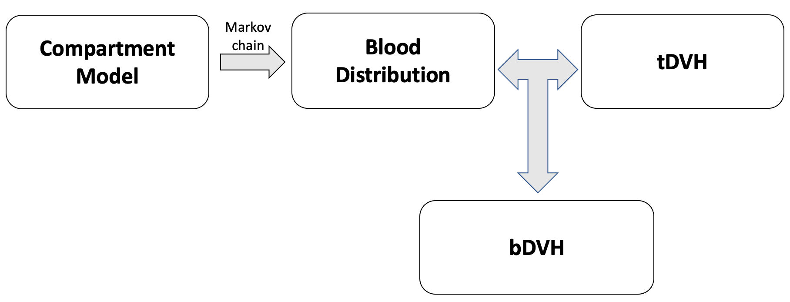

# blood-dvh
Blood DVH 

## Installation

Install dependent packages

```bash
$ pip3 install -r requirements.txt
```

Checkout the python source code
```bash
$ git clone https://github.com/mghro/blood-dvh.git git

```

## Getting started

Run interactive python
```bash
$ cd git
$ ipython3 -pylab
```

#### 1. Load python module



```python

from blooddvh import CompartmentModel
from blooddvh import BloodDistribution
from blooddvh import tDVH
from blooddvh import bDVH

```

#### 1. Create a compartment model from an Excel
```python
sample_size  = 100 
time_per_step  = 1  # sec
steps_per_min  = 60 # number of steps per min, e.g.,  step resolutions are 1 sec and 0.1 sec for 60 and 600, respectively
model = CompartmentModel("input/ICRP89_compartment_model.xlsx", "male", vol=5.3, cardiac=6.5, resolution=steps_per_min)

```

#### 2. Generate Blood distribution using Markov chain
```python
blood = BloodDistribution()
blood.generate_from_markov(model.markov, model.name, model.volume, time_per_step, sample_size, steps_per_min)

```

#### 3. Create a time-dependent DVH

```python
dose = tDVH()
dose.add( 10, lambda x: 2) #First 10 sec, 2 Gy uniform
dose.add( 10, None)        #next  10 sec, no dose
dose.add( 10, lambda x: 5) #next  10 sec, 5 Gy uniform
```

#### 4. Apply tDVH to blood path
```python
model.name  # to choose an organ where the dose is delivered, 0 : brain, 19: liver
blood_dose = bDVH()
blood_dose.compute(blood, dose, 19, beam_start=0)
hist(blood_dose.dose) # Draw your blood DVH (differential)
```


