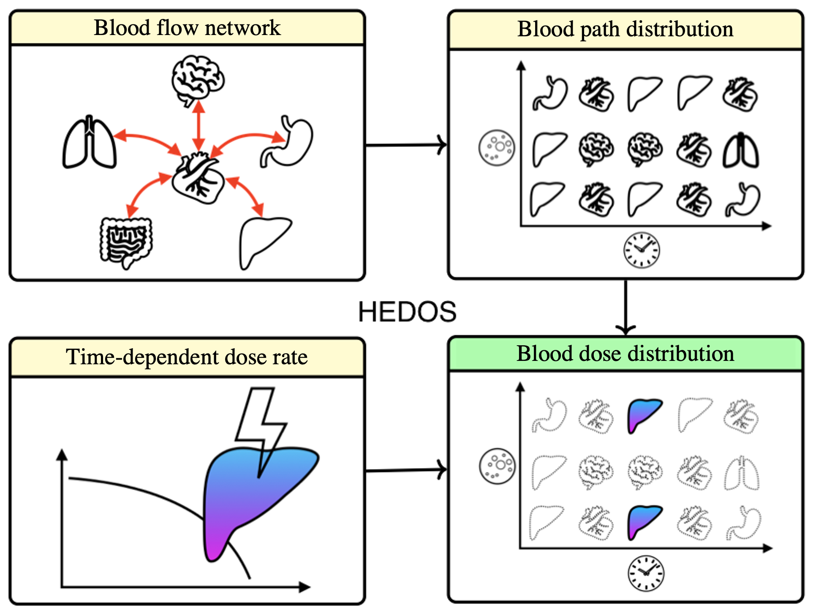
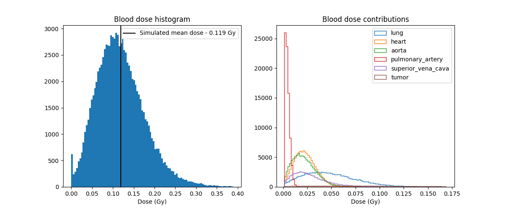
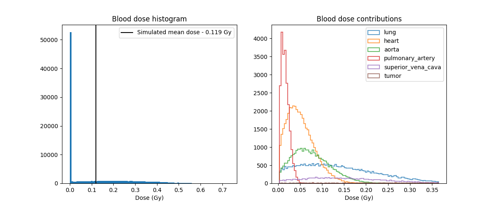

HEDOS : Hematological Dose

## Installation

Checkout the python source code
```bash
$ git clone https://github.com/mghro/hedos.git

```
Install dependent packages

```bash
$ pip3 install -r requirements.txt
```

## Background
Blood flow is stochastically modeled and superimposed with a - potentially time varying - dose rate to calculate the 
blood dose distribution.

This code is a revised version of HEDOS. The old code can be found in the branch named "hedos_old". The main differences 
are:
 - The new code is orders of magnitude faster thanks to vectorization. 
 - We have corrected a mathematical inaccuracy in the way transition probabilities between compartments were computed.
#
For blood dose calculations, the configuration parameters (patient, treatment and simulation parameters) are set up in 
`BloodDose`. It then calls one of two possible workflows: 
- `BloodDoseFromFields` calculates the blood dose given the patient's dose distribution and the segmentations of 
the organs which are contributing to the overall blood dose. For the example here we have used a mesh reference 
phantom (ICRP Publication 145) and create an artificial sample dose. For patient-specific blood dose calculations, 
this should be replaced with patient data.
- `BloodDoseFromDVHs` does the same thing, but uses DVHs of each of the organs contributing to the overall blood 
dose.

#
The calculation of blood dose follows these steps in succession:
- `FlowModel`: Set up a graph that reflects the connectivity and magnitude of blood flow between blood compartments. 
Convert this into a matrix of transition probabilities.  
- `TemporalDistribution`: Simulate the blood flow over time. Blood particles flow through the model by a stochastic 
jumping process based on survival analysis.
- `CompartmentDose`: Accumulate dose in the blood particles over time, based on a time-dependent dose rate.

Their relationship looks like following image:



### Example
Below example output of the fractional blood dose distribution for an imaginary thorax patient who received lung RT with 
a fraction dose of 2 Gy. Top panel: Treatment given in 4 beams of 20s each, temporally separated by 10s to allow for 
gantry motion. Bottom panel: Treatment given in a single beam of 10s. It is clear that changing the dose rate quite 
dramatically affects the blood dose distribution (but not the mean blood dose). Non-zero contributions to the blood dose 
from various anatomical structures are also indicated.





## Team
- Chris Beekman
- Jungwook Shin
- Stella Xing
- Lucas McCullum
- Clemens Grassberger
- Harald Paganetti

## Acknowledgements
This work was supported by:
- R21 CA248118 : A Computational Method to Calculate the Radiation Dose to Circulating Lymphocytes
- R01 CA248901 : Developing whole-body computational phantoms for blood dosimetry to model the impact of radiation on the immune system

## Publications

Shin J, Xing S, McCullum L, et al. HEDOS-a computational tool to assess radiation dose to circulating blood cells during external beam radiotherapy based on whole-body blood flow simulations. Phys Med Biol. 2021;66(16):10.1088/1361-6560/ac16ea. Published 2021 Aug 3. doi:10.1088/1361-6560/ac16ea
