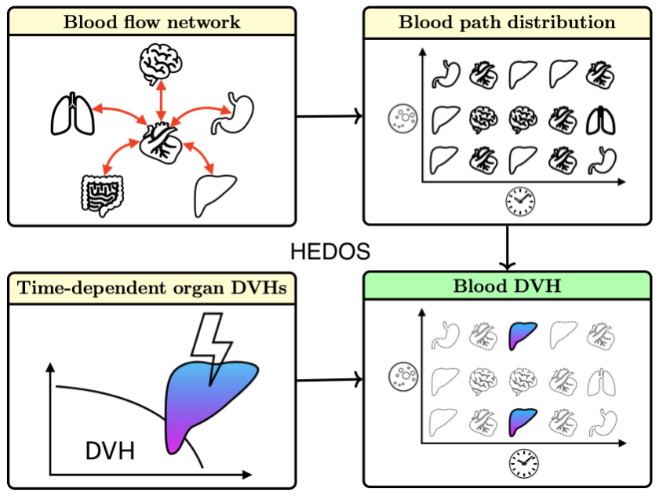
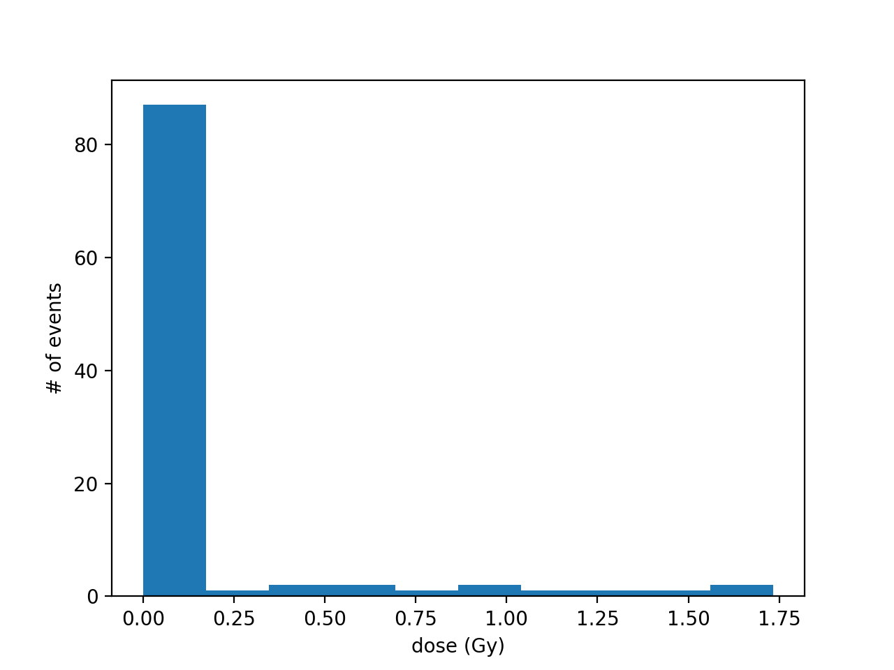

HEDOS : Hematological Dose

## Installation

Checkout the python source code
```bash
$ git clone https://github.com/mghro/hedos.git git

```
Install dependent packages

```bash
$ pip3 install -r requirements.txt
```

## Getting started

Run interactive python
```bash
$ cd git
$ ipython3 -pylab
```

#### 1. Load python module

Four modules are developed for this project. Their relationship look like following image.
CompartmentModel reads in organ's transition flow and generate transition network.
BloodDistribution receives Markov model from CompartmentModel and produces blood particle paths. It can save the generated paths and read back.
tDVH stores DVH as a function of time.
bDVH computes blood dose by applying tDVH to BloodDistribution.


```python

from blooddvh import CompartmentModel
from blooddvh import BloodDistribution
from blooddvh import tDVH
from blooddvh import bDVH

```

#### 2. Create a compartment model from an Excel
```python
sample_size  = 100 
time_per_step  = 1  # sec
steps_per_min  = 60 # number of steps per min, e.g.,  step resolutions are 1 sec and 0.1 sec for 60 and 600, respectively
model = CompartmentModel("input/ICRP89_compartment_model.xlsx", "male", vol=5.3, cardiac=6.5, resolution=steps_per_min)

```

#### 3. Generate Blood distribution using Markov chain
```python
blood = BloodDistribution()
blood.generate_from_markov(model.markov, model.name, model.volume, time_per_step, sample_size, steps_per_min)

```

#### 4. Create a time-dependent DVH

```python
dose = tDVH()
dose.add( 10, lambda x: 2) #First 10 sec, 2 Gy uniform
dose.add( 10, None)        #next  10 sec, no dose
dose.add( 10, lambda x: 5) #next  10 sec, 5 Gy uniform
```

#### 5. Apply tDVH to blood path
tDVH can be applied to multiple organ and different time points
```python
model.name  # to choose an organ where the dose is delivered, 0 : brain, 19: liver
blood_dose = bDVH(blood.df, blood.dt)
blood_dose.add_dose(dose, 19, beam_start=0)
blood_dose.add_dose(dose, 19, beam_start=4)
blood_dose.add_dose(dose, 0, beam_start=0)  #add dose to Brain
hist(blood_dose.dose) # Draw your blood DVH (differential)
```




## Team
- Jungwook Shin
- Stella Xing
- Clemens Grassberger
- Harald Paganetti

## Acknowledgements
This work was supported by R21 CA248118 (A Computational Method to Calculate the Radiation Dose to Circulating Lymphocytes) and R01 CA248901 (Developing whole-body computational phantoms for blood dosimetry to model the impact of radiation on the immune system).
